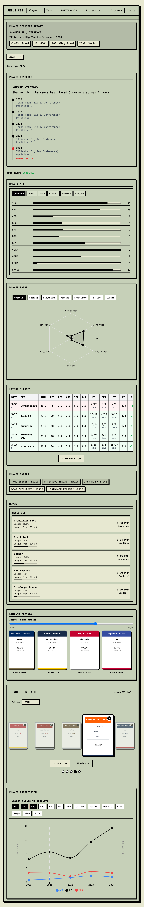
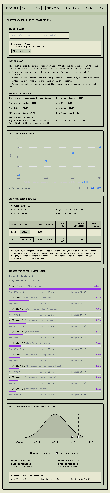
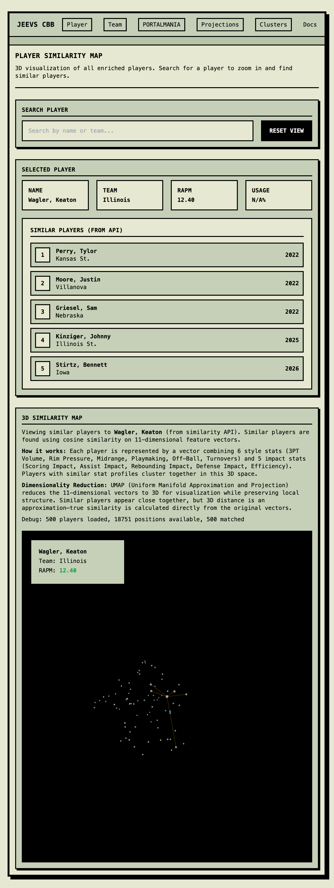
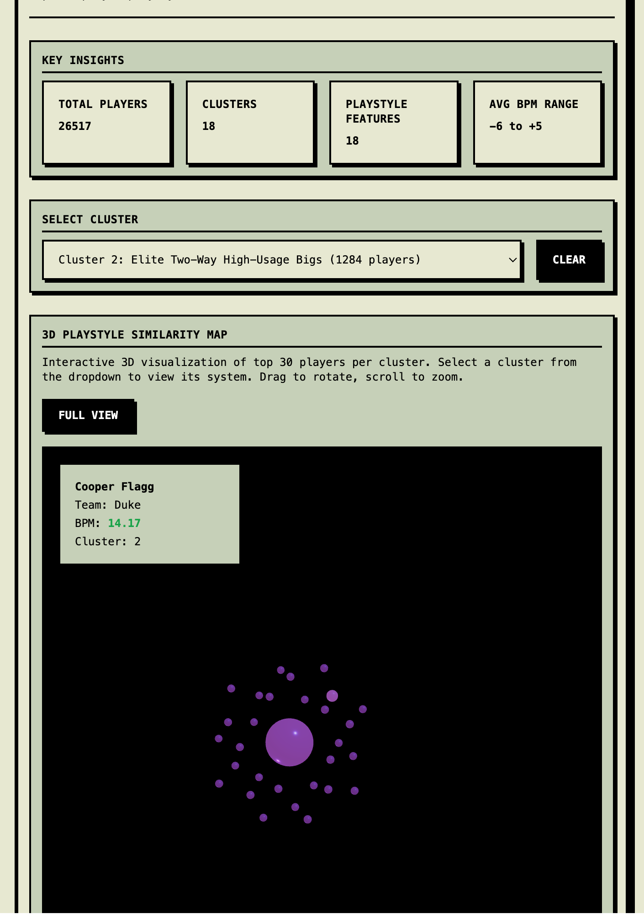
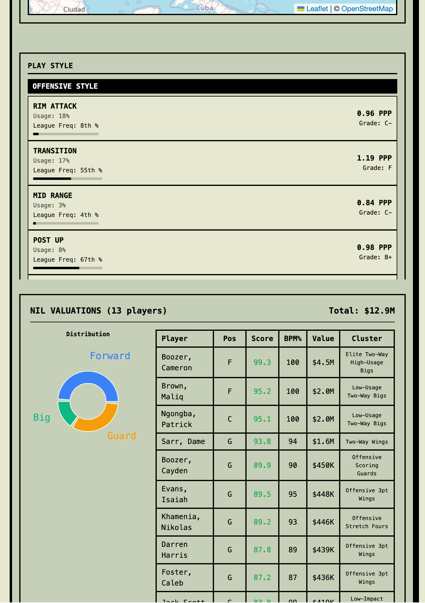

# Product Overview

## Problems We're Solving

JEEVS CBB addresses several critical challenges in college basketball analytics and decision-making:

### 1. Player NIL Evaluation
**Challenge:** Determining fair market value for NIL deals is complex, with no standardized methodology. Traditional metrics like points per game don't capture true player value.

**Solution:** The NIL Valuation Model uses a weighted scoring approach combining:
- Position rank within player's archetype cluster (18 clusters, IDs 0-17)
- Win Shares and BPM percentiles vs all players
- Team success (adjusted net rating)
- Conference prestige (High Major/Mid Major/Low Major tiers)
- Cluster quality (based on average BPM of player's archetype)

**Output:** Estimated dollar range ($0 - $5M) with percentile rankings across all players and by position.

*[View Player Stats & Playstyle](https://jeevs-cbb.vercel.app/player/4432847/year=2024)*

---

### 2. Player Projected Growth
**Challenge:** Predicting how a player will develop over time is difficult for scouting and roster planning. Coaches and GMs need to identify players with growth potential and anticipate future performance.

**Solution:** The BPM Projection Model uses:
- Historical BPM trends across seasons (2019-2026)
- Cluster transition analysis (how players move between archetypes)
- Age-based development curves
- Usage and efficiency relationships
- Team context factors

**Output:** Projected BPM for future seasons (1-3 years ahead) with confidence intervals.

*[View 2027 Projections](https://jeevs-cbb.vercel.app/projections/2027)*

---

### 3. Similar Player Analysis
**Challenge:** Identifying players with similar playing styles is crucial for both roster construction and opponent preparation. Manual comparison is time-consuming and subjective.

**Solution:** The Similarity System combines:
- **Player Clustering:** 18 archetype clusters based on statistical profiles (scoring, playmaking, rebounding, defense, efficiency)
- **Vector Similarity:** High-dimensional feature vectors capturing nuanced playing styles
- **Visual Similarity Map:** 3D visualization showing player relationships

**Output:** List of most similar players with similarity scores, cluster membership, and visual positioning on similarity map.

*[View Similarity Analysis](https://jeevs-cbb.vercel.app/similarity)*

---

### 4. Team Style Analysis
**Challenge:** Understanding team playing styles and strengths/weaknesses is essential for game planning and roster construction. Traditional stats don't capture team identity.

**Solution:** The Team Analysis provides:
- **Archetype Composition:** Shows distribution of player types on each team
- **Usage Patterns:** Analyzes how teams distribute usage among players
- **Efficiency Metrics:** Team offensive/defensive efficiency and context
- **NIL Valuation:** Estimated dollar range for each player on the team

**Output:** Team style profiles, matchup insights, composition analysis, and NIL valuations.

*[View Team Analysis](https://jeevs-cbb.vercel.app/team/72)*

---

## Data Sources & Sourcing

Data is aggregated  from three primary sources, covering the 2019-2026 seasons (8 seasons, ~15,000+ players, 350+ D1 teams, 50,000+ games):

### 1. Bart Torvik (barttorvik.com)
**What:** BPM, advanced player analytics, team efficiency metrics
**How:** Downloaded as CSV files per season
**Key Metrics:** BPM, OBPM, DBPM, usage rate, offensive rating, efficiency metrics

### 2. Hoop Explorer (hoop-explorer.com)
**What:** RAPM (Regularized Adjusted Plus Minus), advanced analytics, roster information
**How:** Downloaded as CSV files with player biographical data
**Key Metrics:** RAPM, height, weight, hometown, position, conference

### 3. College Basketball Data (collegebasketballdata.com)
**What:** Team information, roster data, game-by-game data, basic statistics
**How:** API access for game data, roster information
**Key Data:** Game logs, team rosters, basic player statistics

### Data Processing
- **Joining:** Left join on `AthleteSourceId` (Hoop Explorer ID) with fallback to name+team+year matching
- **Cleanup:** Standardized team names, filled missing BPM with 0 (replacement level), normalized formats
- **Compression:** Gzip compression for storage efficiency (70-85% size reduction)

---

## How it is Built

### Languages
- **Backend:** Python 3.11+
- **Frontend:** TypeScript 6.0.3, JavaScript (React 18)

### Frameworks & Libraries

**Backend:**
- **FastAPI** - Modern web framework for building APIs
- **Pandas** - Data manipulation and analysis
- **Scikit-learn** - Machine learning (K-means clustering, similarity calculations)
- **Pydantic** - Data validation
- **NetworkX** - Graph algorithms
- **Joblib** - Parallel processing and caching

**Frontend:**
- **Next.js 14** - React framework for web applications
- **React 18** - UI library
- **Tailwind CSS** - Styling
- **Framer Motion** - Animations
- **Recharts** - Data visualization
- **Three.js** - 3D graphics (similarity map)
- **Leaflet** - Maps
- **Lucide React** - Icons

### Deployment
- **Frontend:** Vercel
- **Backend:** Railway

### AI-Assisted Development
- **Windsurf/OPUS Models** - Used for:
  - Documentation generation and refinement
  - Frontend component development
  - Data processing scripts
  - Code refactoring and optimization

---

## Why It's Useful for GMs & Coaching Staff

### For Roster Construction
- **Similar Player Scouting:** Find players with similar playing styles to target in recruiting or transfer portal
- **Archetype Balance:** Analyze team composition by player archetypes (18 types) to identify gaps or imbalances
- **NIL Valuation:** Estimate fair market value for NIL deals to inform contract negotiations
- **Projection Modeling:** Identify players with growth potential for long-term roster planning

### For Opponent Preparation
- **Style Analysis:** Understand opponent playing style through archetype composition and usage patterns
- **Similar Player Matching:** Find similar players on your roster to practice against
- **Usage Patterns:** Identify how opponents distribute usage to anticipate game plans
- **Efficiency Breakdowns:** Analyze offensive/defensive strengths and weaknesses

### For Player Development
- **Growth Projections:** See projected BPM for future seasons to track development
- **Cluster Transitions:** Understand common development paths (e.g., how players move between archetypes)
- **Peer Comparisons:** Compare players to similar peers to set realistic development goals
- **Efficiency Context:** Evaluate player efficiency relative to usage and role

### For Decision Making
- **Data-Driven Insights:** Move beyond basic stats to advanced metrics and contextual analysis
- **Visual Communication:** Easy-to-understand visualizations for presenting to stakeholders
- **Historical Context:** Access 8 seasons of historical data for trend analysis
- **Scalable Analysis:** Apply consistent methodology across all players and teams

---

## Product Link

**GitHub Repository:** https://github.com/Jeevs10/jeevs-cbb

**Live Application:** https://jeevs-cbb.vercel.app

---

## Data Coverage

- **Seasons:** 2019-2026 (8 seasons)
- **Players:** ~15,000+ unique players
- **Teams:** 350+ D1 teams
- **Games:** ~50,000+ game records
- **Player Clusters:** 18 archetypes (IDs 0-17)
- **Badge Tiers:** Levels 0-5
